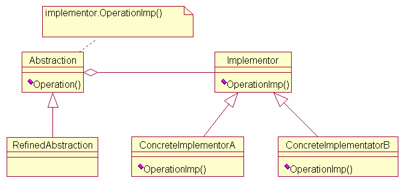

# Bridge pattern

### **Definição:**

* Permite desacoplar uma abstração de sua implementação, de modo que os dois possam variar independente.

## benificios: 
* desacoplamento

### **Participantes:**
* **Abstraction:** define a interface da abstração, mantém uma referência para o objeto do tipo Implementor.

* **Refined Abstraction:** estende a interface definida por abstraction.

* **Implementor:** define a interface para as classes de implementação.

* **Concrete Implementor:** implementa a interface de Implementor e define sua implementação concreta.

#### Diagrama:
 
 
 Fonte: https://www.researchgate.net/profile/Vincenzo_Deufemia/publication/221569637/figure/fig3/AS:667633145880581@1536187554274/The-Bridge-Design-Pattern-Figure-5-shows-the-class-diagram-describing-the-Composite.ppm

