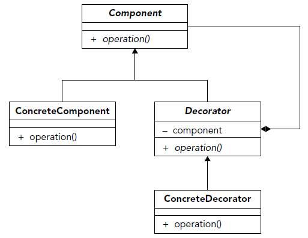

# Decorator pattern

### **Definição:**

* Anexar responsabilidades adicionais a um objeto dinamicamente. Fornece uma alternativa flexível a criação de subclasses para estender funcionalidades.

## Benefícios: 
* Estender funcionalidades sem usar herança.
* Funções são delegadas internamente.
* Evita criar classes com inumeras responsabilidades.

### **Participantes:**

* **Component:** define a interface da para os objetos que podem ter responsabilidades acrescentadas dinamicamente.

* **Concrete componente:** define um objeto para o qual as responsabilidades adicionais podem ser atribuídas.

* **Decorator:** Mantém uma referência para um objeto Component e define uma interface que segue a interface de component.

* **Concrete Decorator:** Acrescenta responsabilidades ao componente.

### **Quando Implementar:**

* quando houver necessidade que uma classe tenha mais funções, adicionando novas funcionalidades ao objeto injetando-o numa nova classe que o implementa e adiciona novos métodos.

#### Diagrama:
 
 
 Fonte: https://arquivo.devmedia.com.br/artigos/Higor_Medeiros/padraodecorator/image001.jpg

