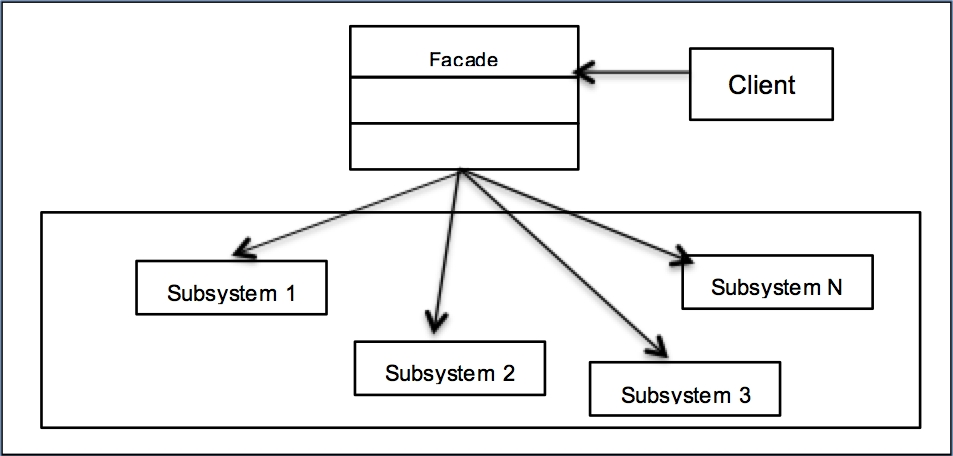

# Decorator pattern

## **Descrição**
* tem como objetivocriar uma forma mais simples de lidar com um istema mais complexo, escondendo muito de sua implementação e fortaçendo o encapsulamento e isolamento.

### **Intenção:**

* Fornecer uma interface unificada para um conjunto de interfaces em um sbsistea Facade define uma interface de nível mais elevado que faz o subsistema mais fácil de usar.

## Benefícios: 
* Torna a aplicação em um todo mais legível ganhando flexibilidade.

### **Participantes:**

* **Façade:** conhece quais as classes do subsistema são responsáveis pelo atendimento de uma solicitação; delega solicitações de clientes a objetos apropriados do subsistema.

* **Classes de subsistema:** implementam as funcioanalidades do subsistema; encarregam-se do trabalho atribuído a elas pelo objeto Façade; não tem conhecimento(referência) do Façade.

<!-- ### **Quando Implementar:**

*  -->
#### Diagrama:
 
 
 Fonte: https://static.packt-cdn.com/products/9781785888038/graphics/B05180_04_01.jpg

