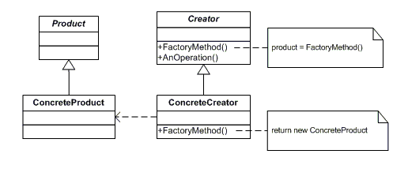

# Factory Method pattern

### **Definição:**
* Define uma interface para criação de um objeto, mas permite que uma subclasse decida qual classe será instanciada. Factory Method permite que uma classe delegue uma instanciação para as subclasses.

### **Participantes:**
* **Product:** define a interface de objetos que o método fábrica cria.

* **Concrete Product:** Esta é uma classe que implementa a interface do Builder para criar um produto complexo.

* **Creator:** declara o método fábrica, o qual retorna um objeto do tipo Produto. Criador também pode definir uma implementação por omissão do método factory que retorna por omissão um objeto ConcreteProduct.

* **Concrete Creator:** redefine o método-fábrica para retornar a uma instância de um ConcreteProduct.

### **Quando Implementar:**
* Uma classe não pode antecipar a classe de objetos que criam.
* Uma classe quer que suas subclasses especifiquem os objetos que criam.
* As classes delegam responsabilidade para uma dentre várias subclasses.
* auxiliares, e você quer localizar o conhecimento de qual subclasse auxiliar que é a delegada.

#### Diagrama:
 
 
 Fonte: https://i.stack.imgur.com/N3mC1.png

