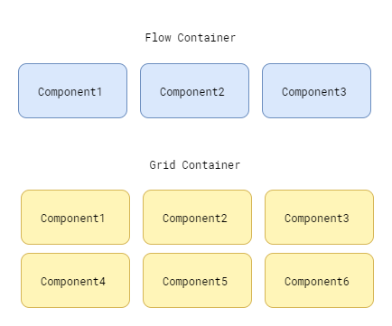

# Programing to favour the composition over inheritance

### _In this project i will use de concept to favour the composition over inheritance, i will use .Net Core console app to do it._

### **Create project console:**

```
>dotnet new console
```

### **Exe localy application:**

```
>dotnet run
```

### **Requirements:**
* Create containers to group [Components](#Component-types) of graphic interface.
* Create two group of containers, [FlowContainer](#FlowContainer) and [GridContainer](#GridContainer).
* Diagram of [requeriments](#Diagram) to containers.
* Both container types must be able to use [borders](#border-types) or not.

#### Component types:
1. Button.
2. TextArea.
3. RadioButton.
4. ...

#### Border types:
1. Solid Border
2. Etched Border
3. ...

#### FlowContainer:
* Group component in a composition left to right in one row.

    #### Requirements

    * Must be able to add and remove components.

    * Must be able to render yourself after created.

    * Must be able to close yourself.

#### GridContainer:

* Group component in a composition left to right in and top to bottom disposing of rows and columns.

    #### Requirements

    * Must be able to add and remove components.

    * Must be able to render yourself after created.

    * Must be able to close yourself.

#### Requirements diagram:
 


