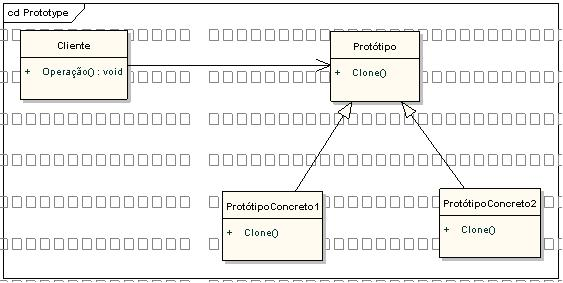

# Prototype pattern

### **Definição:**

* Padrão de projeto de software que permite a criação de objetos a partir de um modelo original, ou protótipo

### **Participantes:**
* **Prototype:** declara uma interface para clonar a si próprio.

* **Concrete Prototype:** implementa uma operação para clonar a si próprio.

* **Client:** cria um novo objeto solicitando a um protótipo que clone a si próprio.

### **Quando Implementar:**

* Quando as classes a instanciar forem especificadas em tempo de execução, por exemplo, por carga dinâmic.

* Para evitar a construção de uma hierarquia de classes de fábricas paralela à hierarquia de classes de produto.

* Quando as instâncias de uma classe puderem ter uma dentre poucas combinações diferentes de estados. Pode ser mais conveniente instalar um número correspondente de protótipos e cloná-los, ao invés de instanciar a classe manualmente, cada vez com um estado apropriado.

#### Diagrama:
 
 
 Fonte: https://www.devmedia.com.br/padroes-de-projeto-em-net-prototype/4597

