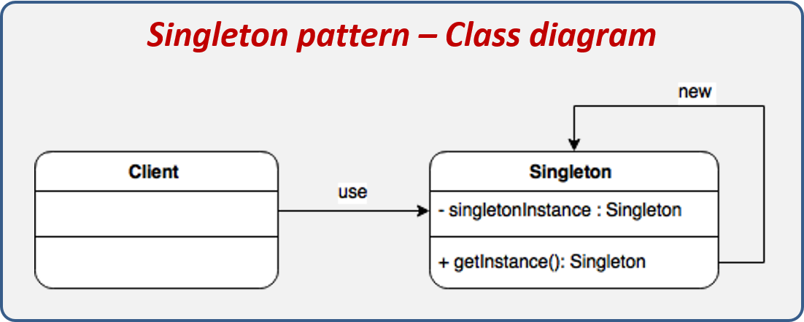

# Singleton pattern

### **Definição:**

* Padrão de projeto de software que permite que uma classe tenha apenas uma instância e fornece um ponto global para acessar a classe.

### **Participantes:**
* **Singleton:** define a geração de uma única instância da classe.

### **Quando Implementar:**

* quando houver necessidade que uma classe tem apenas uma instancia.

#### Diagrama:
 
 
 Fonte: https://reactiveprogramming.io/public/books/patterns/img/patterns-articles/singleton-diagram.png

