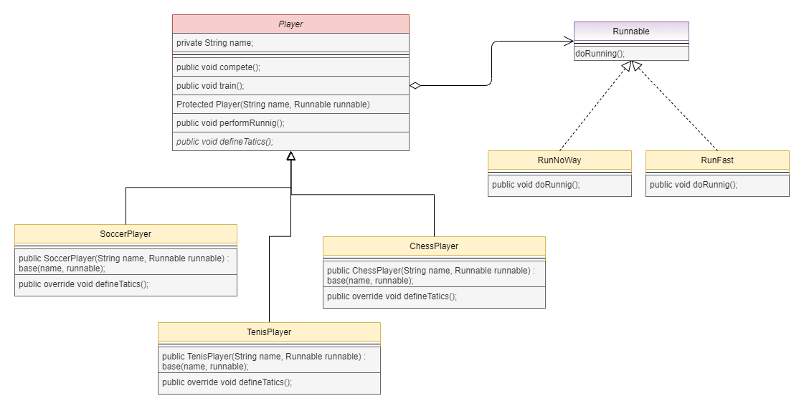

# Encapsulate what varies

### _In this project i will use the principle of encapsulate what varies, i will use .Net Core console app to do it._

### **Create project console:**

```
>dotnet new console
```

### **Exe localy application:**

```
>dotnet run
```

### **Requirements:**
* Create a abstract class called Player.
* Create players to inherit the comportaments of Player.
* Encapsulate the method performRunning because it varies. 

#### Requirements diagram:
 


